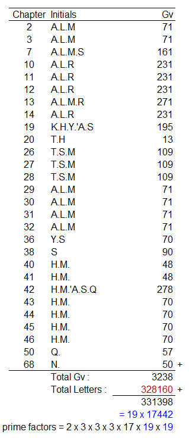
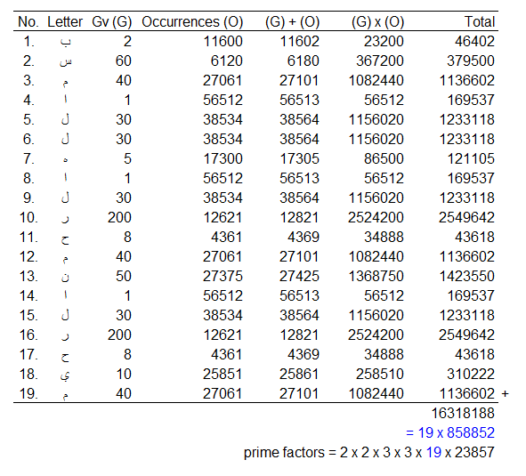

 
Bismillahirahmaanirraheem  
    
Peace be upon those who follow guidance,  

## Background
I have read articles from [Rashad](https://en.wikipedia.org/wiki/Rashad_Khalifa), [submission.org](https://submission.org/), [masjidtucson.org](http://masjidtucson.org/), and others. But there is one remaining question in my head on how this <code>Code 19</code> could preserves all entire number of Quran letters.  

Since they did not share their Quran&#39;s text to be downloaded, so I try to verify it by myself by using Buckwalter data from [here](http://corpus.quran.com/download/), then patch it using the following references from [submission.org](https://submission.org/verify_updated_count_ALM_ALR.html):  

|**No.**|**Chapter**|**Verse**|**Word**|**From**|**To**|**Remark**|**References / Method**|**Ref. in other verses**|
|:---:|:---:|:---:|:---:|:---:|:---:|:---:|:---:|:---:|
|**1.**|2|72|4|فَٱدَّٰرَٰتُمْ|فَٱدَّٰرَءْتُمْ|Too many diacritic|-|3:168|
|**2.**|3|136|2|جَزَآؤُهُمْ|جَزَٰٓؤُهُمْ|[change from imla&#39;i rasm to uthmani](https://submission.org/QI#3%3A136)|Tashkent Quran / Samarkand Codex|12:74; 12:75|
|**3.**|7|38|21|ٱدَّارَكُوا|ٱدَّٰرَكَوا|[change from imla&#39;i rasm to uthmani](https://submission.org/QI#7%3A38)|Tashkent Quran / Samarkand Codex|27:66|
|**4.**|7|46|4|ٱلْأَعْرَافِ|ٱلأَعْرٰفِ|[change from imla&#39;i rasm to uthmani](https://submission.org/QI#7%3A46)|Tashkent Quran / Samarkand Codex|-|
|**5.**|7|48|3|ٱلْأَعْرَافِ|ٱلأَعْرٰفِ|[change from imla&#39;i rasm to uthmani](https://submission.org/QI#7%3A48)|Tashkent Quran / Samarkand Codex|-|
|**6.**|7|66|10|سَفَاهَةٍ|سَفَٰهَةٍ|[change from imla&#39;i rasm to uthmani](https://submission.org/QI#7%3A66)|Tashkent Quran / Samarkand Codex|-|
|**7.**|7|67|5|سَفَاهَةٌ|سَفَٰهَةٌ|[change from imla&#39;i rasm to uthmani](https://submission.org/QI#7%3A67)|Tashkent Quran / Samarkand Codex|-|
|**8.**|7|69|22|بَصْۜطَةً|بَسْطَةً|[change letter Shad to Sin](https://submission.org/QI#7%3A69)|Tashkent Quran / Samarkand Codex|2:247|
|**9.**|7|133|6|وَٱلضَّفَادِعَ|وَٱلضَّفَٰدِعَ|[change from imla&#39;i rasm to uthmani](https://submission.org/QI#7%3A133)|Tashkent Quran / Samarkand Codex|-|
|**10.**|7|145|4|ٱلْأَلْوَاحِ|ٱلْأَلْوَٰحِ|[change from imla&#39;i rasm to uthmani](https://submission.org/QI#7%3A145)|Tashkent Quran / Samarkand Codex|54:13|
|**11.**|7|150|17|ٱلْأَلْوَاحَ|ٱلْأَلْوَٰحَ|[change from imla&#39;i rasm to uthmani](https://submission.org/QI#7%3A150)|Tashkent Quran / Samarkand Codex|54:13|
|**12.**|7|150|24|ٱبْنَ أُمَّ|ٱبْنَؤُمَّ|[change from Aleef to Waw](https://submission.org/QI#7%3A150)|Tashkent Quran / Samarkand Codex|20:94|
|**13.**|7|154|7|ٱلْأَلْوَاحَ|ٱلْأَلْوٰحَ|[change from imla&#39;i rasm to uthmani](https://submission.org/QI#7%3A154)|Tashkent Quran / Samarkand Codex|54:13|
|**14.**|7|163|14|حِيتَانُهُمْ|حِيتَٰنُهُمْ|[change from imla&#39;i rasm to uthmani](https://submission.org/QI#7%3A163)|Tashkent Quran / Samarkand Codex|-|
|**15.**|**9**|**128**|-|-|-|<code>removed</code>|<code>Code 19</code> pattern|-|
|**16.**|**9**|**129**|-|-|-|<code>removed</code>|<code>Code 19</code> pattern</code>|-|
|**17.**|10|15|4|ءَايَاتُنَا|ءَايَٰتُنَا|[change from imla&#39;i rasm to uthmani](https://submission.org/QI#10%3A15)|Tashkent Quran / Samarkand Codex|22:51; 22:72|
|**18.**|10|21|13|ءَايَاتِنَا|ءَايَٰتِنَا|[change from imla&#39;i rasm to uthmani](https://submission.org/QI#10%3A21)|Tashkent Quran / Samarkand Codex|22:51; 22:72|
|**19.**|13|4|10|صِنْوَانٌ|صِنْوَٰنٌ|[change from imla&#39;i rasm to uthmani](https://submission.org/QI#13%3A4)|Tashkent Quran / Samarkand Codex|-|
|**20.**|13|4|12|صِنْوَانٍ|صِنْوَٰنٍ|[change from imla&#39;i rasm to uthmani](https://submission.org/QI#13%3A4)|Tashkent Quran / Samarkand Codex|-|
|**21.**|13|5|19|أَعْنَاقِهِمْ|أَعْنَٰقِهِمْ|[change from imla&#39;i rasm to uthmani](https://submission.org/QI#13%3A5)|Tashkent Quran / Samarkand Codex|38:8; 40:71|
|**22.**|13|14|23|دُعَآءُ|دُعَٰٓؤُا|[change from Aleef to Waw](https://submission.org/QI#13%3A14)|Tashkent Quran / Samarkand Codex|40:50|
|**23.**|13|17|42|ٱلْأَمْثَالَ|ٱلْأَمْثَٰلَ|[change from imla&#39;i rasm to uthmani](https://submission.org/QI#13%3A17)|Tashkent Quran / Samarkand Codex|24:35; 25:9|
|**24.**|68|1|1|ن|نُونْ|[change from Nun to Nun Waw Nun](https://submission.org/QI#68%3A1)|<code>Code 19</code> pattern|-|

|||
|:---:|:---|
| **25.** | Add Basmalah to all chapters except 1 and 9, and its verse number is 0 (zero)

  
## Verifying ..
I assumed all reader already know what <code>Arabic Gematria</code> is. But if you haven't know, you can read it first at [here](https://en.wikipedia.org/wiki/Abjad_numerals) or [here](https://submission.org/what_is_a_numeral.html). And on this article, the gematria value will be abbreviated as <code>Gv</code>.

And this is what Rashad did not explain on his articles, about how this <code>Code 19</code> could preserves entire number of Quran letters. I calculate the total number of letters in the Quran (including Basmalah in each chapter except chapters 1 and 9), and the result is: **<Code>3 2 8 1 6 0</Code>**

Let us check it with this <code>Code 19</code>, and see its awesomeness :(far fa-grin-squint fa-fw):

### It&#39;s connected to all initial letters in Quran chapters.
<!--  -->

<!--  -->

  
### All letters occurrences base on Basmalah letters.
From here, we all can see that the Basmalah, the Crown of Quran and its letters could also act as a Guardian or Quick Tester.  
<!--  -->


  
### All letters occurrences base on unique Basmalah letters.
Again, the Basmalah act as a Guardian or Quick Tester.  

<!--  -->

**2393** is Gv for [7:68] and [32:13].
> <Code>[7:68]</Code> _I convey to you the messages of my Lord, and I am to you a trustworthy advisor._  
> <Code>[32:13]</Code> _If We had wished, We could have given every person its guidance, but the word from Me has taken effect, that I will fill Hell with Jinn and Humans all together!_  

  
### All letters occurrences base on initial leters.
These are occurrences of letters base on all initial letters in every chapters. <Code>From here we will know the function of initial letters and its Gv.</Code>

#### Pairs #1: A.L.M
<!--  -->


**1046** is Gv for [95:7], **1702** is Gv for [38:2], **2748** is Gv for [99:6], **523** is Gv for [38:56] and [55:2].
> <Code>[95:7]</Code> _&quot;So after this, what would make you deny the judgment?&quot;_  
> <Code>[38:2]</Code> _&quot;[Whereas] so many nations before them We have destroyed, they cry out when it was far too late.&quot;_  
> <Code>[99:6]</Code> _&quot;On that day, the people will be brought out in throngs to be shown their deeds.&quot;_  
> <Code>[38:56]</Code> _&quot;Hell, where they will be burned. What a miserable abode!&quot;_  
> <Code>[55:2]</Code> _&quot;[Messages from] The One Who teach Quran.&quot;_

  
#### Pairs #2: A.L.M.S - A.L.R - A.L.M.R - N

**815** is Gv for [50:24], **1595** is Gv for [22:49], [26:54], and [26:218]. **2410** is Gv for [10:96], and **241** is Gv for [1:4]. Let's decode it ..  
> <Code>[50:24]</Code> _&quot;Throw into Hell every stubborn rejecter!&quot;_  
> <Code>[22:49]</Code> _&quot;Say, &#39;O people, I am only a clear warner to you.&#39;&quot;_  
> <Code>[26:54]</Code> _&quot;Indeed, those [who believe] are only a small group.&quot;_  
> <Code>[26:218]</Code> _&quot;[But put your trust to] Who sees you when you arise.&quot;_  
> <Code>[10:96]</Code> _&quot;Indeed, those upon whom the word of your Lord has come into effect will not believe.&quot;_  
> <Code>[1:4]</Code> _&quot;[Messages from] The King of the judgment day.&quot;_

  
#### Pairs 4#: K.H.Y.'A.S

**313** is Gv for [80:8]  
> <Code>[80:8]</Code> _&quot;[Except] The one who came to you eagerly [for this wisdom]&quot;_

  
#### Pairs 5#: YS - S

**1260** is Gv for [89:6], and **1283** is Gv for [10:62]
> <code>[89:6]</code> _&quot;Did you not see what your Lord did to &#39;Aad?&quot;_
> <code>[10:62]</code> _&quot;Absolutely, God&#39;s allies have nothing to fear, nor will they grieve.&quot;_

  
#### Pairs 6#: H.M

**2247** is Gv for [72:1], and **2484** is Gv for [27:89]
> <code>[72:1]</code> _&quot;Say, &#39;It has been revealed to me that a group of Jinn listened, and said, &#39;Indeed, we have heard an amazing reads/Quran&#39;&quot;_
> <code>[27:89]</code> _&quot;Those who bring good deeds will receive far better rewards, and they will be perfectly secure from the horrors of that day.&quot;_

  
#### Pattern 7#: Q

### Separation.

### Let&#39;s exclude all initial letters in its chapter from our calculation, and see what happen.

**673** is Gv for [98:3].
> <code>[98:3]></code> _&quot;Within which are correct writings.&quot;_

  
## **Conclusions:**
> <Code>[41:53]</Code>  _We will show them Our signs in the horizons, and within themselves, until it becomes clear to them that this is the truth. [But] Is it not enough that your Lord is a witness over all things?_ <Code>[74:16]</Code>  _No, he was instead stubborn to Our signs._ <Code>[74:35]</Code>  _[Whereas] it is one of the greatest_ <Code>[74:36]</Code>  _as a warning to people_ <Code>[74:37]</Code>  _for any among you who wishes to progress/advance or regress/lag behind._ <Code>[74:49]</Code>  _[But] why did they turn away from this reminder,_ <Code>[74:50]</Code>  _like fleeing Zebra_ <Code>[74:51]</Code>  _running from a Lion?_ <Code>[2:87]</Code>... _Is it not a fact that every time a messenger went to you with anything you disliked your ego caused you to be arogant, some of them you rejected, and some of them you killed?_ <Code>[46:10]</Code>  _Say, have you ever thought: how if what you deny is really from God, which a witness from the children of Israel has witnessed the same phenomenon and he believed, while you turn away arrogantly? Surely, God does not guide the wicked people!_ <Code>[47:38]</Code>  _... And if you indeed turn away, He will replace you with another people, then they will not be like you!_
